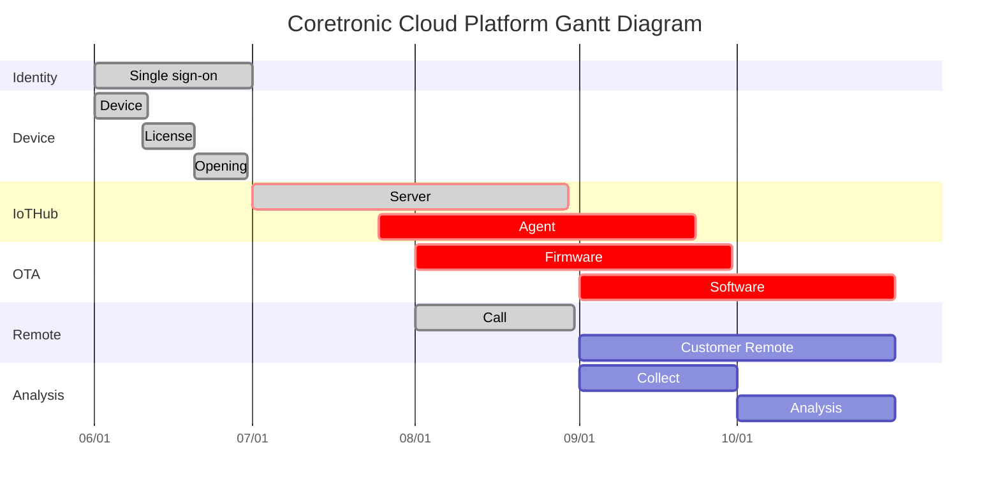

## Project Build Status

| IdentityServer | AdminWeb | WebAPI & IoT WebAPI |
| -------- | -------- | -------- |
|      |      |      |

## Project Timeline

```mermaid
gantt
    title Coretronic Cloud Platform Gantt Diagram
    
    dateFormat  YYYY-MM-DD
    axisFormat  %m/%d
    
    section Identity
    Single sign-on    :done,    sso,    2019-06-01, 30d
    section Device
    Device    :done, d, 2019-06-01, 10d
    License    :done, l, 2019-06-10, 10d
    Opening    :done, after l, 10d
    section IoTHub
    Server      :done, crit,    2019-07-01  , 60d
    Agent      :crit,    2019-07-25,    60d
    section OTA
    Firmware    :crit,    2019-08-01,    60d
    Software    :crit,    2019-09-01,    60d
    section Remote
    Call:done, 2019-08-01,    30d
    Customer Remote    : 2019-09-01,    60d
    section Analysis
    Collect    : 2019-09-01,    30d
    Analysis    : 2019-10-01,    30d
```