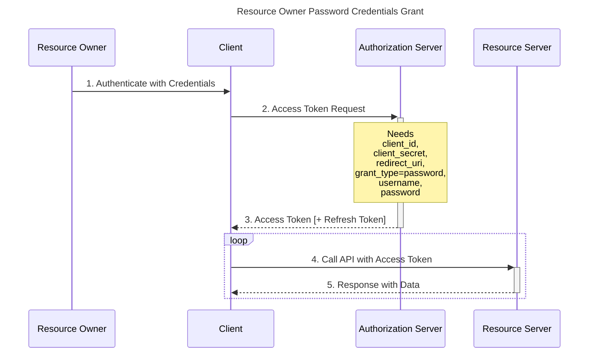

## Grant Types
Grant types are a way to specify how a client wants to interact with IdentityServer.
The OpenID Connect and OAuth 2 specs define the following grant types:

* **Implicit**: used with Mobile Apps or Web Applications (applications that run on the user's device)

```sequence
Title: Implicit
Resource Owner->Client: 1. Click login link
Client->Authorization Server: 2. Credential Request to /authorize
Authorization Server->Resource Owner: 3. Redirect to login /authorization prompt
Resource Owner->Authorization Server: 4. Authenticate and Consent
Authorization Server->Client: 5. Requested credentials(ID Token and/or Access Token)
Client->Resource Server: 6. Request user data with Access Token
Resource Server->Client: 7. Response
```

* **Client Credentials**: used with Applications API access

```sequence
Title: Client Credentials

Client->Authorization Server: 1. Authenticate with Client ID + Client Secret to /token
Authorization Server->Authorization Server: 2. Validate Client ID + Client Secret
Authorization Server->Client: 3. Access Token
Client->Resource Server: 4. Request data with Access Token
Resource Server->Client: 5. Response
```

* **Authorization Code** : used with server-side Applications

```sequence
Title: Authorization code
Resource Owner->Client: 1. Click login link
Client->Authorization Server: 2. Authorization Code Request to /authorize
Authorization Server->Resource Owner: 3. Redirect to login /authorization prompt
Resource Owner->Authorization Server: 4. Authenticate and Consent
Authorization Server->Client: 5. Authorization Code
Client->Authorization Server: 6. Authorization Code + Client ID + Client Secret to /oauth/token
Authorization Server->Authorization Server: 7. Validate Authorization Code + Client ID + Client Secret
Authorization Server->Client: 8. ID Token and Access Token
Client->Resource Server: 9. Request user data with Access Token
Resource Server->Client: 10. Response
```
```csharp=
https://identity-dev.core-pcloud.com/connect/authorize?response_type=code&client_id=CLIENT_ID&redirect_uri=CALLBACK_URL&scope=read
```
* **Authorization Code Flow with Proof Key for Code Exchange (PKCE)**

```sequence
Title: Authorization Code Flow with Proof Key for Code Exchange (PKCE)
Resource Owner->Client: 1. Click login link
Client->Client: 2. Generate Code Verifier and Code Challenge 
Client->Authorization Server: 3. Authorization Code Request + Code Challenge to /authorize
Authorization Server->Resource Owner: 4. Redirect to login /authorization prompt
Resource Owner->Authorization Server: 5. Authenticate and Consent
Authorization Server->Client: 6. Authorization Code
Client->Authorization Server: 7. Authorization Code + Code Verifier to /oauth/token
Authorization Server->Authorization Server: 8. Validate Code Verifier and Challenge
Authorization Server->Client: 9. ID Token and Access Token
Client->Resource Server: 10. Request user data with Access Token
Resource Server->Client: 11. Response
```

* **Resource Owner Password Credentials Grant** : used with trusted Applications, such as those owned by the service itself

```sequence
Title: Resource Owner Password Credentials Grant
Resource Owner->Client: 1. Authenticate with Credentials
Client->Authorization Server: 2. Access Token Request
Note over Authorization Server: Needs client_id, client_secret, redirect_uri,\ngrant_type=password, username, password
Authorization Server-->>Client: 3. Access Token [+ Refresh Token]

Note over Client,Resource Server: Loop
Client->Resource Server: 4. Call API with Access Token
Resource Server-->>Client: 5. Response with Data

```



* **Device Flow** : Device flow is designed for browserless and input constrained devices, where the device is unable to securely capture user credentials. This flow outsources user authentication and consent to an external device (e.g. a smart phone).

This flow is typically used by IoT devices and can request both identity and API resources.

[ref](https://auth0.com/docs/flows)