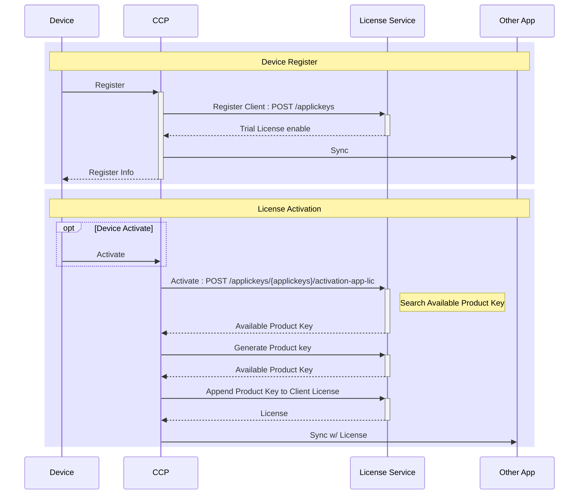

### License flows

#### Device Register

```mermaid
sequenceDiagram

participant Device
participant CCP
participant LS as License Service
participant App as Other App

rect rgba(0, 0, 255, .1)
Note over Device,App: Device Register
Device ->> +CCP : Register
CCP ->> +LS : Register Client : POST /applickeys
LS -->> -CCP : Trial License enable
CCP ->> App : Sync
CCP -->> -Device : Register Info
end

rect rgba(0, 0, 255, .1)
Note over Device,App: License Activation
opt Device Activate
Device ->> CCP: Activate
end
CCP ->> +LS : Activate : POST /applickeys/{applickeys}/activation-app-lic
Note right of LS: Search Available Product Key
LS -->> -CCP : Available Product Key

CCP ->> +LS : Generate Product key
LS -->> -CCP : Available Product Key

CCP ->> +LS : Append Product Key to Client License
LS -->> -CCP : License

CCP ->> App : Sync w/ License

end
```