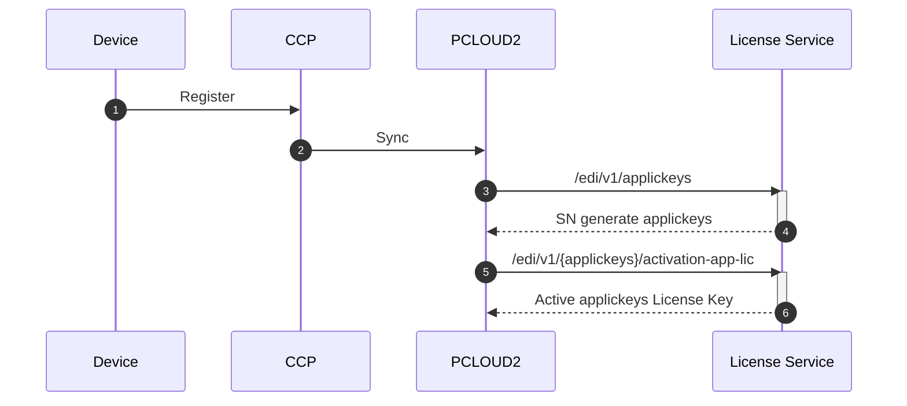

### License flows

```mermaid
sequenceDiagram
autonumber
participant Device
participant CCP
participant PCLOUD2
participant LS as License Service

Device ->> CCP : Register
CCP ->> PCLOUD2 : Sync
PCLOUD2 ->> LS : /edi/v1/applickeys
activate LS
LS -->> PCLOUD2 : SN generate applickeys
deactivate LS
PCLOUD2 ->> LS : /edi/v1/{applickeys}/activation-app-lic
activate LS
LS -->> PCLOUD2 : Active applickeys License Key
deactivate LS

```